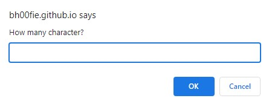

# Password Generator

## Introduction

Webpage deployed at: https://bh00fie.github.io/PasswordGenerator/

In this challenge, I'll be using the concepts you've learned to complete the required activity.
In this project, I'll be creating an app that runs in the browser and features dynamically updated HTML and CSS, all powered by JavaScript code that I will have ti write. The app has a clean and polished user interface that is responsive and I have ensured that it adapts to multiple screen sizes.

This project consists to create a password generator that takes different inputs from the user and generates a usable password.
The password can include special characters, lowercase letters, uppercase letters and numbers.

---

## Description

I was given an initial code containing character arrays and the function that will show the password on the webpage. To solve this problem I have proceeded as follows:

- Prompt a message asking for password length -> Verify if the input is a number -> If so verify the number is between the suggested range between 10 and 64 characters long;
- Ask user if they want to include any number, special character, or upper and lower case letters;
- Create a function that takes as input and array and outputs a random character from the given array;
- Create a new array that gets filled up by a given initial array depending on the user preference;
- Create a loop that generates a string (password) depending on the user's decided length by adding (concatenating) each random given character next to each other.

JS file has been commented on to help understand written code if interested in looking into it more in-depth.
The code has been deployed on the following webpage: https://bh00fie.github.io/PasswordGenerator/

## Final Results
When you open your code in the browser my resulting analysis should look similar to the following:

- User Input: 

Character Length

Lowercase Character

Uppercase Character

Numbers

Special Character

- Result:

The output is as following:

As requested by the description of this challenge, the website has been made responsive:

---

## License

MIT Licence

---

© 2022 edX Boot Camps LLC. Confidential and Proprietary. All Rights Reserved.